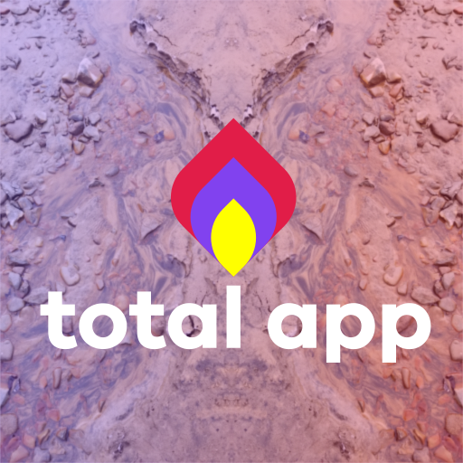

# Total App | Starter App

<!-- markdownlint-disable MD033 -->
<!-- prettier-ignore -->
<table>
    <tbody>
        <tr>
            <td rowspan=2 style="vertical-align:bottom;">
                
            </td>
            <td align=center>Storybook</td>
            <td align=center><a href="https://app.netlify.com/sites/total-app/deploys"></a></td>
            <td align=center><a href="https://vercel.com/iva2k/total-app"></a></td>
            <td align=center>
<a href="https://github.com/iva2k/total-app/issues"></a>
            </td>
            <td align=center>
<a href="https://github.com/iva2k/total-app/pulls"></a>
            </td>
            <td align=center><a href="https://discord.gg/CnCM2EvSW8"></a></td>
        </tr>
        <tr>
            <td align=center><a href=https://www.chromatic.com/builds?appId=65a02a765c0010e653425b30>Chromatic</a></td>
            <td align=center><a href="https://total-app.netlify.app">App Demo</a></td>
            <td align=center><a href="https://total-app.vercel.app">App Demo</a></td>
            <td align=center colspan=2><a href="https://github.com/iva2k/total-app">Github
               <!--  -->
            </a></td>
            <td align=center><a href="https://discord.gg/CnCM2EvSW8">Discord</a></td>
        </tr>
    </tbody>
</table>
<!-- markdownlint-enable MD033 -->

<!--  -->

A cross-platform Desktop / Mobile / Web application starter.

**License:** MIT License

## Introduction

Total App is a versatile starter app designed to streamline the development process. Out of the box it provides a full technology stack to deploy from a single codebase to any device across all major platforms:

- iOS
- Android
- Windows
- MacOS
- Linux
- Web

## Key Features

- **SEO and Social Integration:** Optimized for search engines and social networks.
- **Flexible Rendering:** Supports SSR, SPA, and PWA (mix & match as needed) for various use cases.
- **Native Features:** Includes support for camera, GPS, and other native capabilities via Capacitor.
- **Great Developer Experience (DX):** Built with SvelteKit with linting, formatting, and comprehensive testing, isolated component development.
- **Ready for Deployment:** Configured for quick deployment on Netlify, Vercel, or building standalone apps for AppStore/PlayStore and more.

## Technology Stack

### Built with

[ Svelte + Svelte Kit](https://svelte.dev)  
[ Tauri](https://tauri.app)  
[ Capacitor](https://capacitorjs.com)  
[ Prettier](https://prettier.io/)  
[ ESLint](https://eslint.org)  
[ Stylelint](https://stylelint.io/)  
[ Postcss](https://postcss.org/)  
[ Playwright](https://playwright.dev)  
[ Vitest](https://vitest.dev)

### Isolated Component Development

Choose a [branch](#branches) for your preferred Isolated Component Development:

[ Storybook](https://storybook.js.org) |
[ Histoire](https://histoire.dev/)

### Choose UI Components


## Start TotalApp from Github

To try this app locally, clone it from Github, execute in your terminal (need `git` and `nodejs` installed):

```bash
git clone https://github.com/iva2k/total-app.git my-new-total-app
cd my-new-total-app
pnpm install
cp .env.EXAMPLE .env
pnpm run dev -- --open
```

## Start Your App

To start your app from `TotalApp` as a template, choose UI framework branch to use (after '#') and execute in your terminal:

```bash
MY_APP="my-app"  # Any name you like for the app (will be a folder name)
# Any UI branch you like to use, choose one:
UI_BRANCH="ui-agnostic"
UI_BRANCH="ui-bootstrap"
UI_BRANCH="ui-bulma"
# (see other UI framework branches below)

cd ~ && mkdir "$MY_APP" && cd "$MY_APP"
npx degit "iva2k/total-app#${UI_BRANCH}"

# Then you can make a new repo and push the folder to your Guthub account (google it to learn how)
```

### Or Fork the Repo on Github

Visit [Github](https://github.com/iva2k/total-app/fork) and follow instructions.

### Setup Configuration File

Copy provided `.env.EXAMPLE` to `.env` (may also create `.env.production` and `.env.dev` as needed) and modify it for your site.

`.env.*` files are listed in .gitignore to be never committed to the repo.

```bash
cp .env.EXAMPLE .env
```

When deploying your website to any provider (Netlify, Vercel), make sure to set all the variables listed in `.env.EXAMPLE` with the provider's UI to keep them secure. DO NOT COMMIT .env files to repo!

## Developing Locally

Please follow the [Tauri Getting Started Guide](https://tauri.app/v1/guides/getting-started/prerequisites) to setup your system with the required [Rust](https://www.rust-lang.org/) toolchain.

This application is built like a typical Node.js application. However, instead of `npm`, [`pnpm`](https://pnpm.io/) is used for package management.

> **Note:** You may use `yarn` or `npm`, but only a `pnpm` lockfile is included, and some scripts call `pnpm` directly and need to be changed to your package manager.

```bash
pnpm install # or npm install
```

### Start development server

```bash
pnpm run dev

# or start the development server and open the app in a new browser tab
pnpm run dev -- --open
```

## Building

To create a production version of the web app (to be hosted on a server):

```bash
pnpm run build
```

To preview the production build of the web app, execute `pnpm run preview`.

To deploy the app, you will need to install an [adapter](https://kit.svelte.dev/docs/adapters) for the target environment. Netlify and Vercel adapters are already installed and automatically selected when deploying to these providers.

## Desktop App

To run desktop app (using Tauri)

```bash
pnpm run tauri:dev
# The app window will open
```

To create desktop executable:

```bash
pnpm run tauri:build
```

## Mobile App

To update mobile app project (Android):

```bash
pnpm run build
cap open android
```

iOS platform is installed but not fully scripted in this repo, custom scripts can easily be added. See [CREATING](./CREATING.md)

## Customizing

Check file `src/lib/config/websiteFnc.js` for setting all information about the App / Website.

Variables for backend integrations are set in `.env` file.

## How This App Was Created

See [CREATING](./CREATING.md) for step-by-step instructions.

## Styling / UI Components

This template has DarkMode component in the header to allow switching the color scheme between 'light' and 'dark'. It changes the theme using `<html color-scheme>` (see `src/routes/styles.css`).

There are many UI frameworks that work with Svelte / SvelteKit, and the choice can be daunting.

<https://bestofsvelte.com/t/ui-library>

<https://sveltesociety.dev/components/>

Some UI framеworks are implemented in [Branches](#branches).

It is not too hard to add a new UI framework, as long as it supports Svelte 5 - just look at minimal changes in the existing framework branches. Currently there are no plans to implement additional frameworks (either listed below or not), but good PRs will be accepted.

## Branches

This project has few of the top UI frameworks integrated, as well as Isolated component development with Storybook and Histoire added in separate git branches.

Any of UI branch and any of Isolated component development branch can be merged into UI branch of choice for your app.

<!-- markdownlint-disable MD033 -->
<!-- prettier-ignore -->
| UI Framework                                                  | Git Branch                                  | Dark Theme | Svelte 5 | Notes [Legend: ⬤ Yes / ⭘ No / ❌ Fail] | Status |
|-|-|:-:|:-:|-|-|
|                                                               | main                                        | ⬤ | ⬤ | | [](https://total-app.vercel.app/api/getDeployment?w=url&b=main)                     |
|                                                               | [histoire](../../tree/histoire)             | ⬤ | ❌ | Isolated component development. <br>❌ Story Build fails. | [](https://total-app.vercel.app/api/getDeployment?w=url&b=histoire)             |
|                                                               | [storybook](../../tree/storybook)           | ⬤ | ⬤ | Isolated component development. | [](https://total-app.vercel.app/api/getDeployment?w=url&b=storybook) |
| [ AgnosticUI](https://github.com/AgnosticUI/agnosticui)        | [ui-agnostic](../../tree/ui-agnostic)       | ⬤ | ⭘ | Last v1.1.27 published in 2021 | [](https://total-app.vercel.app/api/getDeployment?w=url&b=ui-agnostic) |
| [ Bootstrap](https://github.com/twbs/bootstrap)                | [ui-bootstrap](../../tree/ui-bootstrap)     | ⬤ | ⭘ | [Sveltestrap](https://github.com/sveltestrap/sveltestrap), Themes from [Bootswatch](https://github.com/thomaspark/bootswatch).<br>⭘ [ [sveltestrap#79] ](https://github.com/sveltestrap/sveltestrap/issues/79) | [](https://total-app.vercel.app/api/getDeployment?w=url&b=ui-bootstrap) |
| [ Bulma](https://bulma.io/)                                    | [ui-bulma](../../tree/ui-bulma)             | ⬤ | ⬤ | | [](https://total-app.vercel.app/api/getDeployment?w=url&b=ui-bulma) |
| [ Carbon](https://carbon-components-svelte.onrender.com/)      | [ui-carbon](../../tree/ui-carbon)           | ⬤ | ⬤ | | [](https://total-app.vercel.app/api/getDeployment?w=url&b=ui-carbon) |
| [ Framework7](https://framework7.io/svelte/introduction.html)  | [ui-framework7](../../tree/ui-framework7)   | ⭘ | ⭘ | ⭘ [ [framework7#4296] ](https://github.com/framework7io/framework7/issues/4296) | [](https://total-app.vercel.app/api/getDeployment?w=url&b=ui-framework7) |
| [ Shoelace](https://shoelace.style/)                           | [ui-shoelace](../../tree/ui-shoelace)       | ⬤ | ⬤ | | [](https://total-app.vercel.app/api/getDeployment?w=url&b=ui-shoelace) |
| [ SvelteUI](https://www.svelteui.dev)                          | [ui-svelteui](../../tree/ui-svelteui)       | ⬤ | ⭘ | ⭘ [ [svelteuidev#491] ](https://github.com/svelteuidev/svelteui/issues/491) | [](https://total-app.vercel.app/api/getDeployment?w=url&b=ui-svelteui) |
| [ TailwindCSS](https://tailwindcss.com) | [ui-tailwindcss](../../tree/ui-tailwindcss) | ⬤ | ⬤ | May use components, e.g. [Flowbite](https://flowbite.com/docs/getting-started/introduction/) | [](https://total-app.vercel.app/api/getDeployment?w=url&b=ui-tailwindcss) |
| [ Konsta](https://konstaui.com/svelte)                         | [ui-konsta](../../tree/ui-konsta)           | ⬤ | ⬤ | (Requires TailwindCSS) | [](https://total-app.vercel.app/api/getDeployment?w=url&b=ui-konsta) |
| [ SvelteUX](https://svelte-ux.techniq.dev)                     | [ui-svelteux](../../tree/ui-svelteux)       | ⬤ | ⬤ | (Requires TailwindCSS) | [](https://total-app.vercel.app/api/getDeployment?w=url&b=ui-svelteux) |
| [ Flowbite](https://flowbite-svelte.com)                       | [ui-flowbite](../../tree/ui-flowbite)       | ⬤ | ⬤ | (Requires TailwindCSS) | [](https://total-app.vercel.app/api/getDeployment?w=url&b=ui-flowbite) |
| [Skeleton](https://github.com/skeletonlabs/skeleton)          |                                             |    | ⬤ | (Requires TailwindCSS)<br>⬤ Note [ [skeleton#2640] ](https://github.com/skeletonlabs/skeleton/discussions/2640) | |
| [Smelte](https://smeltejs.com/)                               |                                             |    | ⭘ | (Requires TailwindCSS) Material + TailwindCSS | |
| [Ionic](https://ionicframework.com)                           |                                             |    | ⭘ | See good [example](https://github.com/Tommertom/svelte-ionic-app). Note: No SSR! | |
| [Chota](https://jenil.github.io/chota/)                       |                                             |    | ⭘ | [SvelteChota](https://alexxnb.github.io/svelte-chota/why_chota) | |
| [Tachyons](https://tachyons.io)                               |                                             |    | ⭘ | | |
| [Svelte Material](https://sveltematerialui.com/)              |                                             |    | ⬤ | [`pnpm i -D @smui/\*\*@alpha`](https://github.com/hperrin/svelte-material-ui/tree/v8#readme) | |
| [Svelte Flat UI](https://svelteui.js.org/#/)                  |                                             |    | ⭘ | | |
| [Attractions](https://github.com/illright/attractions)        |                                             |    | ⭘ | | |
| [Melt UI](https://melt-ui.com)                                |                                             |    | ⭘ | ⭘ [ [melt-ui#1001] ](https://github.com/melt-ui/melt-ui/issues/1001) | |
| [Bits UI](https://bits-ui.com)                                |                                             |    | ⭘ | ⭘ [ [bits-ui#287] ](https://github.com/huntabyte/bits-ui/issues/287) | |
| [shadcn-svelte](https://www.shadcn-svelte.com)                |                                             |    | ⭘ | ⭘ [ [shadcn-svelte#1182] ](https://github.com/huntabyte/shadcn-svelte/pull/1182) | |

<!-- markdownlint-enable MD033 -->

## Conclusion

Precursor project was started with Svelte 3/4, and this repository was initiated using early preview releases of Svelte 5, and once Svelte 5 was released, updated to the latest.

As Svelte 5 is still very new, many UI frameworks are lagging in updates and not yet fully compatible with Svelte 5 - there are some incompatibilities and broken features.

If you are interested in a stable version with Svelte 3/4, please refer to the earlier [Svelte 3/4 version of this project](https://github.com/iva2k/svelte-blank-20221125) at commit [#64eb11a](https://github.com/iva2k/svelte-blank-20221125/tree/64eb11af86cc81931d21e3f7c8851c2094044574), that includes fully functional UI frameworks.

As updates and fixes for Svelte 5 and the UI frameworks are released, they will be incorporated into this project.

See Q & A below and file issues and submit PRs on [Github](https://github.com/iva2k/total-app/issues)!

[](https://github.com/iva2k/total-app/issues)
[](https://github.com/iva2k/total-app/pulls)

## Questions?

See [Q & A](./QANDA.md) for more or reach out on Discord:

[](https://discord.gg/CnCM2EvSW8)

## Enjoy! \\\_/


